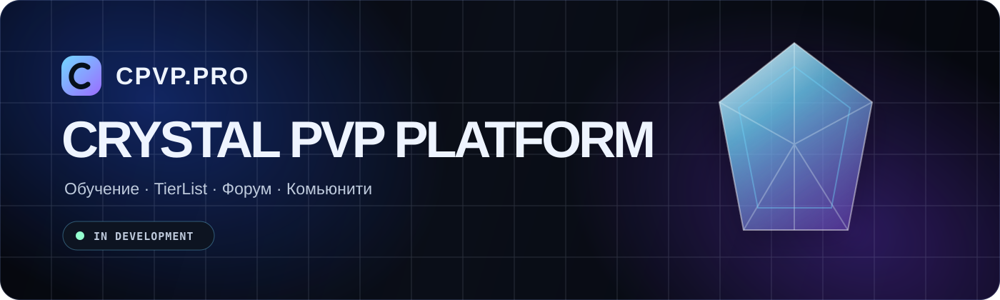

<div align="center">
  
</div>

# CPVP.PRO

**CPVP.PRO** — будущая русскоязычная платформа для игроков Minecraft Crystal PvP. Проект объединит обучение, TierList игроков, форум и комьюнити-инструменты в одном интерфейсе.

Сейчас в репозитории находится оптимизированная временная landing page для домена [`cpvp.pro`](https://cpvp.pro/).

## Статус проекта

> **In development** — публичная версия платформы ещё не запущена.

Текущий этап: подготовка основы проекта, визуального языка и инфраструктуры для дальнейшей разработки полноценного сайта.

## Документация

- [`docs/PROJECT.md`](docs/PROJECT.md) — краткий обзор текущего состояния проекта.
- [`docs/ROADMAP.md`](docs/ROADMAP.md) — этапы дальнейшей разработки.
- [`docs/DESIGN.md`](docs/DESIGN.md) — правила визуального языка и работы с дизайн-ассетами.
- [`CONTRIBUTING.md`](CONTRIBUTING.md) — правила внесения изменений.

## Планируемые разделы

| Раздел | Назначение |
|---|---|
| Обучение | Гайды, механики, разборы ошибок и путь развития игрока |
| TierList | Рейтинги игроков, уровни, категории и прозрачная структура оценок |
| Форум | Обсуждения, дуэли, поиск игроков и полезные материалы |
| Комьюнити | Единая точка входа для Crystal PvP-сообщества |

## Текущая landing page

Страница намеренно сделана максимально лёгкой:

- без JavaScript;
- без фреймворков;
- без внешних шрифтов;
- без внешних изображений;
- без отдельных CSS-запросов;
- с адаптивной мобильной версией;
- с поддержкой `prefers-reduced-motion`;
- с inline SVG favicon;
- с оптимизированными CSS-анимациями через `transform` и `opacity`.

## Структура репозитория

```text
cpvp-pro/
├── .github/
│   ├── ISSUE_TEMPLATE/
│   │   └── bug_report.md          # шаблон сообщения об ошибке
│   ├── CODEOWNERS                 # владелец изменений в репозитории
│   └── PULL_REQUEST_TEMPLATE.md   # единый шаблон Pull Request
├── assets/
│   └── readme-banner.svg          # фирменный баннер README
├── docs/
│   ├── DESIGN.md                  # визуальный язык проекта
│   ├── PROJECT.md                 # обзор текущей реализации
│   └── ROADMAP.md                 # этапы разработки
├── .editorconfig                  # единый стиль форматирования файлов
├── .gitignore                     # исключения для локальных файлов
├── .nojekyll                      # отключение обработки Jekyll
├── 404.html                       # фирменная страница ошибки
├── CNAME                          # подключение домена cpvp.pro
├── CONTRIBUTING.md                # правила внесения изменений
├── README.md                      # описание проекта
└── index.html                     # production landing page
```

## Локальный запуск

Для просмотра landing page достаточно открыть `index.html` в браузере.

Для локального HTTP-сервера можно использовать Python:

```bash
python -m http.server 8080
```

После запуска страница будет доступна по адресу `http://localhost:8080`.

## Деплой

Текущая версия рассчитана на публикацию через GitHub Pages.

Домен задаётся файлом `CNAME`:

```text
cpvp.pro
```

После изменений в ветке `main` GitHub Pages автоматически обновляет опубликованную версию сайта.

## Принципы разработки

При дальнейшем развитии проекта рекомендуется сохранять следующие правила:

1. Не добавлять зависимости без измеримой пользы.
2. Проверять влияние каждого визуального эффекта на производительность мобильных устройств.
3. Загружать только критически необходимые ресурсы на первом экране.
4. Использовать семантическую HTML-разметку и доступные интерактивные элементы.
5. Следить за Core Web Vitals после каждого крупного изменения интерфейса.
6. Сохранять единый визуальный стиль: тёмный premium gaming UI, чистая сетка и умеренные неоновые акценты.

## Roadmap

- [x] Подключить домен `cpvp.pro`
- [x] Разместить временную landing page
- [x] Убрать внешние зависимости из критического пути
- [x] Добавить оформление и документацию репозитория
- [x] Добавить фирменную страницу `404`
- [ ] Спроектировать структуру полноценной платформы
- [ ] Подготовить UI-kit и дизайн-систему
- [ ] Реализовать систему аккаунтов
- [ ] Добавить раздел обучения
- [ ] Реализовать TierList
- [ ] Запустить форум и комьюнити-функции

Полная версия roadmap находится в [`docs/ROADMAP.md`](docs/ROADMAP.md).

## Лицензия

Лицензия пока не выбрана. До появления отдельного файла `LICENSE` исходный код проекта не считается открытым для свободного копирования, изменения или распространения.
